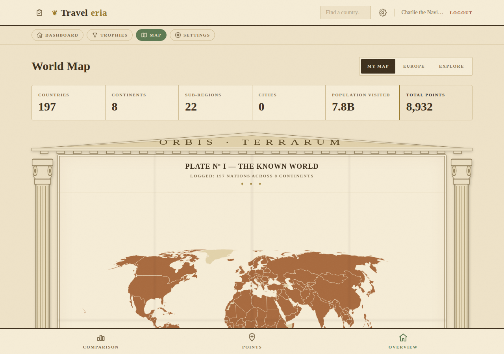
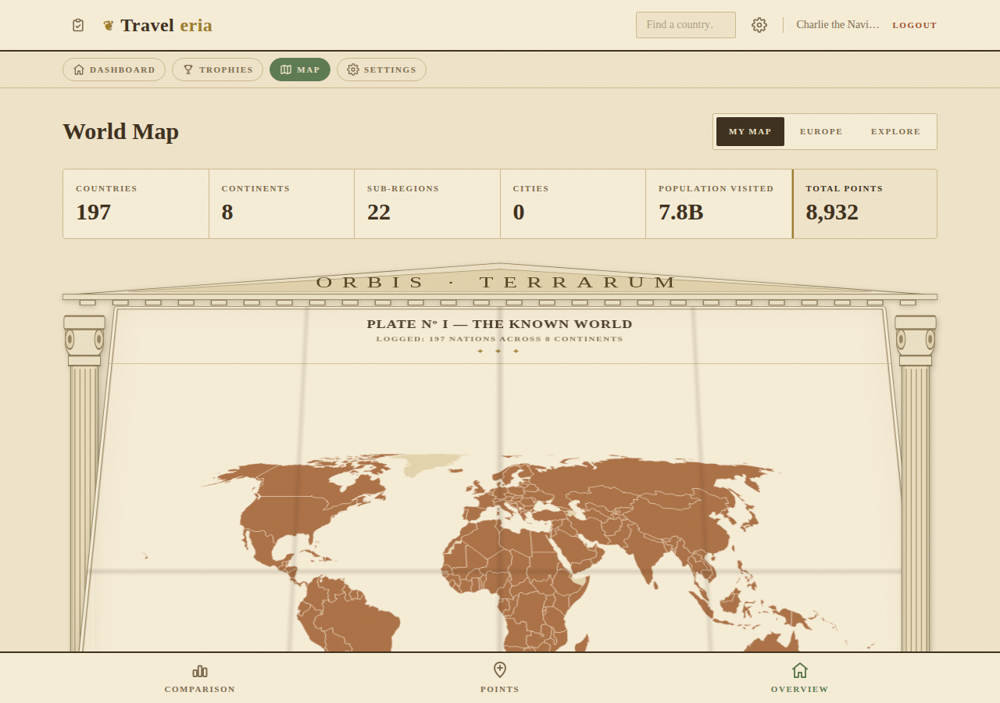
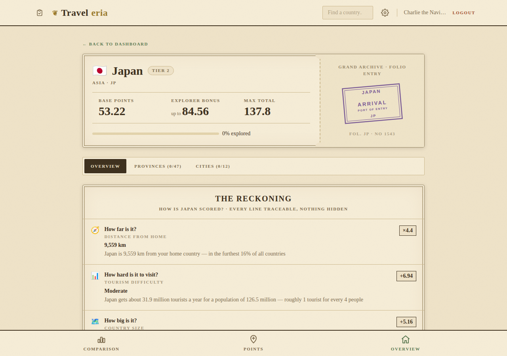
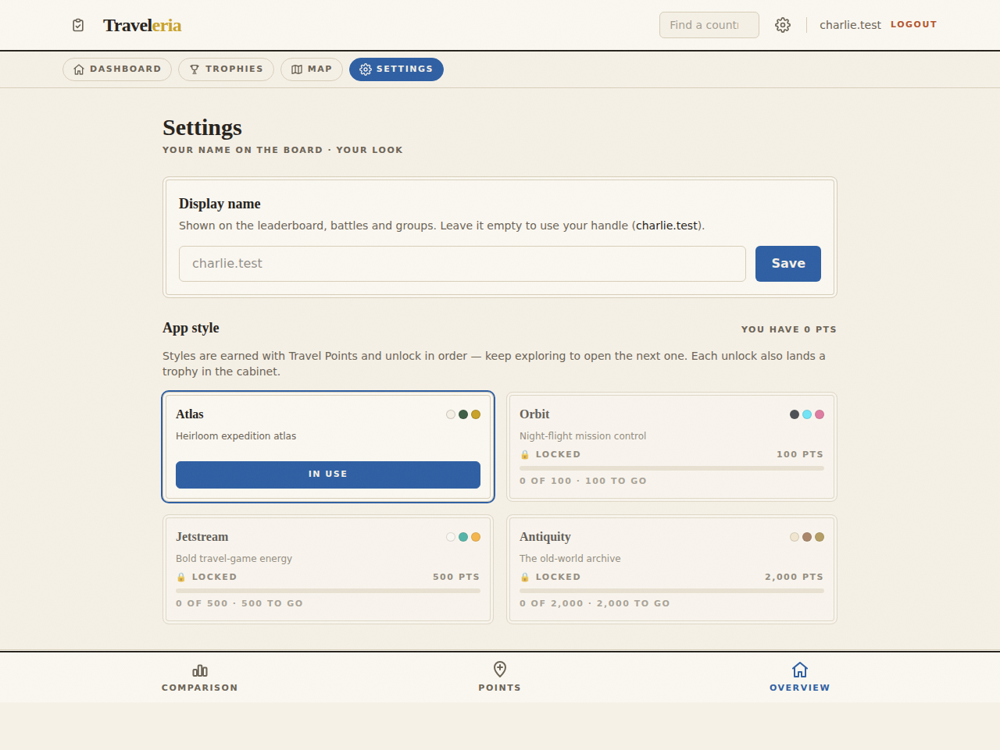

# Unlockable Styles & the Antiquity Design (issue #69)

**Status:** Implemented — pending Charlie's review.
**Branch:** `claude/unlockable-styles-antiquity-gxe3vf`
**Design lineage:** issues #60 (style tokens), #63 (theme registry + slots), #52 (trophy ladder)

## What

Four things, one feature:

1. **A fourth design system — Antiquity.** A vintage old-world-map style: aged
   parchment, sepia ink, engraved serif type, muted hand-tinted country
   colours. The world map sits between Greek columns under a carved pediment,
   and **unfolds like a physical map** when the page opens. Country pages get
   an antique ledger stub with the passport stamp rendered in faded archive ink.

2. **Styles are now earned.** Every non-default style has a Travel Points
   threshold. The picker shows locked styles greyed out with their price and
   your progress; the server refuses to persist a locked choice. Unlock order
   (per the issue): **Atlas (default) → Orbit → Jetstream → Antiquity**.

3. **A Settings tab** — the *only* place to change style (the switcher is gone
   from the top bar and the auth pages), plus a **display name** the
   leaderboard (and battles/groups) show instead of your sign-in handle.

4. **The map is the landing page.** Opening the app signed-in lands on
   `/map`, not the dashboard.

## Why these thresholds

The issue asks to look at what users actually score and pick numbers so only
the top scorers hold the complete set. The production user table isn't
readable from this branch, but we already have a calibrated yardstick: the
**Travel Points ladder** (issue #52) was tuned against the real user base —
bronze 100 · silver 500 · gold 1,000 · diamond 2,000 · platinum 3,000.
Reusing those rungs keeps one consistent definition of "a big score" across
the whole app:

| Style | Threshold | Ladder rung it mirrors | Feel |
|-------|-----------|------------------------|------|
| Atlas | 0 (default) | — | everyone |
| Orbit | **100 pts** | The 100 Club (bronze) | a real trip or two — an early reward that teaches "styles are earned" |
| Jetstream | **500 pts** | The 500 Club (silver) | a committed traveller |
| Antiquity | **1,500 pts** | between the gold and diamond clubs | top scorers only — the prestige style |

A brand-new user sees all four styles in Settings from day one (locked ones
show their price and a progress bar), so the chase is visible. Each unlock
also has a trophy in the cabinet (below), so it's discoverable even before
you open Settings.

Numbers live in `styleUnlocks.js` (client + server copies, kept in step like
`STYLE_IDS`) — Charlie can retune them in one place per side.

## How it works

### Unlock mechanics

- **Source of truth for "your points"** is the same score the dashboard and
  leaderboard show: engine total + sub-region bonuses
  (`getUserScoreLocal`). The server recomputes the same number in
  `PUT /users/:id/style` and rejects a locked style with a 422 — the client
  UI is convenience, the server is the gatekeeper (exactly the plan written
  down in docs/features/design-rendering.md when `unlock` was reserved).
- Theme definitions carry `unlock: null | { points }` in the registry;
  `ThemeContext` exposes `styleAccess` (points + per-style locked state) and
  `setTheme` refuses locked ids client-side too.
- **No migration of old selections** (per the issue): a user who already had
  Jetstream saved keeps it; the gate applies to *changing* style.
- Points never go down in practice, but if a user removes a country and drops
  below a threshold, their current style stays — again, only changes are gated.

### Style trophies (3 new specials — cabinet grows 46 → 49)

| Trophy | Medal | Earned at |
|--------|-------|-----------|
| Night Flight (Orbit) | silver seal · "O" | 100 pts |
| Jet Set (Jetstream) | gold seal · "J" | 500 pts |
| The Antiquarian (Antiquity) | diamond seal · "A" | 1,500 pts |

Earned detail points at Settings ("equip it in Settings"), locked detail
shows points to go — the unlock is discoverable from the cabinet.

### Display name

- New nullable `users.display_name` column (non-destructive migration).
- `users_public` (snapshot + change feed + local worker DDL) now carries
  `display_name`; the worker adds the column idempotently so existing local
  DBs upgrade in place in dev. In prod the deploy's APP_SCHEMA_VERSION bump
  re-snapshots clients anyway.
- `PUT /users/:id/profile` validates (trimmed, 1–40 chars, empty clears back
  to the handle) and records the full public row in `_changes`, so other
  users' devices pick the rename up on the next poll.
- Everywhere another user is shown — leaderboard, territory battle, state
  battle, groups — renders `display_name || identifier` via one helper
  (`lib/names.js publicName`). Your handle remains the sign-in credential.

### Antiquity rendering

- **Tokens** (`:root[data-theme="antiquity"]`): deep parchment paper, sepia
  inks, hand-tint map colours (faded terracotta for visited land, pale wash
  for unvisited), antique gold. Display face is "IM Fell English" (the
  classic old-map face, added to the Google Fonts link) over Fraunces.
- **Map furniture is a theme slot.** The registry gains an optional
  `MapFrame` component slot; `Map.jsx` wraps the world-map plate in it when
  present (no `theme.id` branching, per the registry rules). Antiquity's
  frame draws fluted Greek columns either side with a pediment across the
  top, and plays the **unfold animation** on mount: the plate opens like a
  folded paper map (perspective rotateX + rising fold-crease shadows that
  fade once flat). `prefers-reduced-motion` skips the animation.
- **Country stamps:** Antiquity's stub reuses the deterministic
  `PassportStamp` art (same stamp per country everywhere) inside an archive
  ledger stub ("Recorded in the grand archive"), tinted by the sepia tokens.
- Trophy cabinet, leaderboard, plates, smallcaps etc. pick up the token block
  plus a small set of antiquity-scoped chrome rules — same pattern as the
  other three styles.

## Verified in Chromium

Full flow exercised in the browser (signup → locked settings → forced-write
rejected by the server → 197 countries logged → unlock → switch → every page
re-rendered in Antiquity):

## Open questions

- Are 100 / 500 / 1,500 right once we can eyeball the live leaderboard?
  (Antiquity started at 2,000; Charlie set it to 1,500 on review.) The
  constants are one-line changes in `styleUnlocks.js` (both copies).
- Should the *dashboard* keep its "first tab" spot in the bottom bar now the
  map is the landing page? (Left as-is for now.)
- Antiquity map fills are token-driven; if Charlie wants per-country
  hand-tint variation (like the reference image's pastel patchwork), that's a
  follow-up on top of the same frame.
