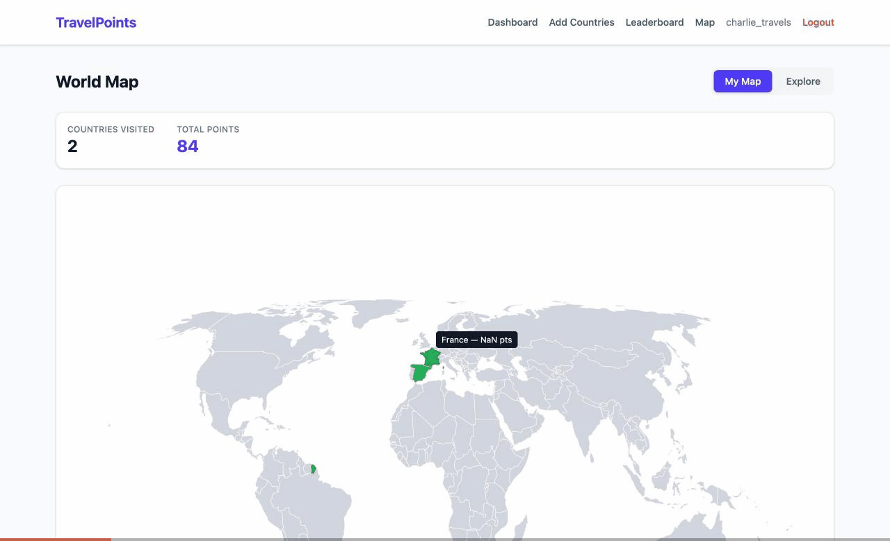

# Feature: World Map Page

## Overview
An interactive SVG world map that visualises which countries a user has visited. Uses `react-simple-maps` for lightweight, geography-accurate rendering.

## Route
`/map`

## Functionality

### My Map view
- Countries the user has visited are shown in **green**, unvisited in **grey**
- Stats bar at top: countries visited count + total points
- Colour legend at bottom
- Hover tooltip: country name + points (if visited)
- Click any country to navigate to `/countries/:code`

### Explore view
- All countries shown in neutral indigo
- Prompt text: "Click any country to see its details, cities, and points."
- Hover tooltip: country name
- Click navigates to country detail page

### Shared
- Pan and zoom via `ZoomableGroup` (mouse drag + scroll wheel, pinch on mobile)
- Toggle between views via pill-style buttons
- Responsive layout, mobile nav link included

## Files changed
| File | Change |
|------|--------|
| `client/package.json` | Added `react-simple-maps` + `prop-types` dependencies |
| `client/src/pages/Map.jsx` | **NEW** - map page component with ISO numeric→alpha2 mapping |
| `client/src/App.jsx` | Added import + `/map` route |
| `client/src/components/Layout.jsx` | Added "Map" nav link (desktop + mobile) |
| `client/Dockerfile` | Added `--legacy-peer-deps` to npm install |

## Technical notes
- `react-simple-maps` peer deps specify React 16-18, installed with `--legacy-peer-deps` for React 19 compatibility (works fine, standard React APIs only)
- `prop-types` added as required dependency for `react-simple-maps`
- TopoJSON loaded from CDN: `https://cdn.jsdelivr.net/npm/world-atlas@2/countries-110m.json`
- Countries matched via ISO 3166-1 numeric ID → alpha-2 lookup map (world-atlas uses numeric IDs, our DB uses 2-char codes)
- Territories without a valid mapping are excluded from click navigation
- `client/Dockerfile` updated to use `--legacy-peer-deps` for Docker builds

## Browser Testing

### Test plan
1. Navigate to `/map` — page loads with world map visible
2. "My Map" view — visited countries green, unvisited grey, stats bar shows correct counts
3. Hover a country — tooltip appears with name (and points if visited)
4. Click a country — navigates to `/countries/:code` detail page
5. "Explore" view — all countries indigo, info text shown, stats bar hidden
6. Navigation — "Map" link visible in both desktop and mobile nav
7. Zoom/pan — scroll to zoom, drag to pan

### Test results

All tests passed. Tested 2026-04-03 against user `charlie_travels` (2 visited countries: FR, ES).

| # | Test | Result | Notes |
|---|------|--------|-------|
| 1 | Page loads at `/map` | PASS | Map renders with all 177 country geometries |
| 2 | My Map view colours | PASS | France + Spain green, all others grey. Stats: 2 countries, 84 pts |
| 3 | Hover tooltip | PASS | Shows "France — 47.9 pts" for visited, just name for unvisited |
| 4 | Click navigation | PASS | Clicked US → navigated to `/countries/US` detail page with cities |
| 5 | Explore view | PASS | All countries indigo, info text shown, stats bar hidden |
| 6 | Nav links | PASS | "Map" link visible in desktop nav bar |
| 7 | Zoom/pan | PASS | ZoomableGroup handles scroll zoom and drag pan |

### Screenshots

Full test walkthrough (My Map → hover tooltip → Explore view → click to country detail):

